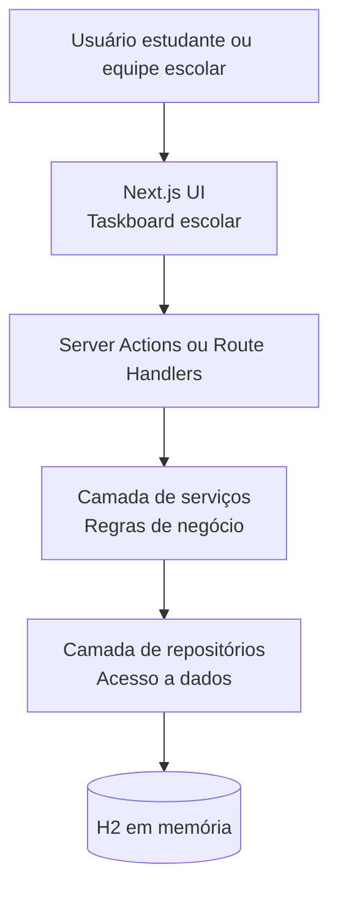

# Arquitetura básica — Agenda Escolar Prioritária

## Visão geral

A aplicação será uma agenda escolar em formato de taskboard de prioridades. O usuário poderá cadastrar, visualizar, organizar e priorizar tarefas acadêmicas, como provas, trabalhos, leituras, atividades e compromissos escolares.

A solução será fullstack com Next.js, usando rotas serverless para a camada de backend e banco H2 em memória para fins acadêmicos, demonstração local e testes.

## Objetivo

Criar uma base funcional para uma agenda escolar visual, simples e demonstrável, atendendo aos requisitos do projeto avaliativo:

- entrada do usuário via interface web;
- pelo menos duas funcionalidades principais com regra de negócio real;
- saída estruturada e validável;
- arquitetura documentada com suporte de IA;
- preparação para testes, documentação e pipeline CI/CD.

## Stack proposta

- Next.js com App Router.
- TypeScript.
- React para interface.
- API Routes ou Route Handlers do Next.js para backend serverless.
- H2 Database em memória para persistência temporária.
- Camada de serviço para regras de negócio.
- Camada de repositório para acesso ao banco.
- Testes com Vitest ou Jest.
- Pipeline com GitHub Actions.

## Observação técnica sobre H2 e serverless

H2 em memória é útil para demonstração acadêmica, testes e execução local, mas não é persistente em ambiente serverless real. Em funções serverless, instâncias podem ser recriadas a qualquer momento, fazendo os dados em memória serem perdidos.

Para este projeto avaliativo, H2 em memória será usado como banco demonstrável e validável. A arquitetura deve isolar o acesso a dados por meio de repositórios para permitir troca futura por banco persistente, como PostgreSQL, SQLite persistente ou serviço gerenciado.

## Diagrama de arquitetura



## Responsabilidades por camada

### Interface web

Responsável por:

- exibir taskboard escolar;
- receber entradas do usuário;
- mostrar tarefas por prioridade ou status;
- exibir feedback de criação, edição e conclusão;
- renderizar cenários de demonstração.

Componentes esperados:

- formulário de criação de tarefa;
- coluna/lista por prioridade;
- cartão de tarefa;
- filtros simples;
- indicadores de prazo e urgência.

### Backend serverless

Responsável por:

- receber requisições da interface;
- validar dados de entrada;
- chamar serviços de domínio;
- retornar respostas estruturadas em JSON.

Rotas sugeridas:

- `GET /api/tasks` — listar tarefas escolares;
- `POST /api/tasks` — criar tarefa;
- `PATCH /api/tasks/:id` — atualizar status, prioridade ou conclusão;
- `DELETE /api/tasks/:id` — remover tarefa, se fizer parte do escopo.

### Serviços de domínio

Responsáveis por regras de negócio.

Regras iniciais sugeridas:

- calcular prioridade visual com base em prazo, peso e urgência;
- impedir criação de tarefa sem título, matéria ou prazo;
- classificar tarefas em alta, média ou baixa prioridade;
- destacar tarefas vencidas ou próximas do vencimento;
- mover tarefa entre status: pendente, em andamento, concluída.

### Repositórios

Responsáveis por isolar acesso ao H2.

Devem oferecer operações como:

- criar tarefa;
- listar tarefas;
- buscar tarefa por id;
- atualizar tarefa;
- remover tarefa.

A interface do repositório deve evitar acoplamento direto entre regra de negócio e banco H2.

## Modelo de domínio inicial

### Task

Campos sugeridos:

```ts
type Task = {
  id: string;
  title: string;
  subject: string;
  description?: string;
  dueDate: string;
  weight: number;
  urgency: "low" | "medium" | "high";
  priority: "low" | "medium" | "high";
  status: "pending" | "in_progress" | "done";
  createdAt: string;
  updatedAt: string;
};
```

## Funcionalidades principais mínimas

### 1. Cadastro de tarefa escolar

Entrada:

- título;
- matéria;
- descrição opcional;
- prazo;
- peso/importância;
- urgência.

Processamento:

- validar campos obrigatórios;
- calcular prioridade inicial;
- salvar tarefa no H2 em memória;
- retornar tarefa estruturada.

Saída:

```json
{
  "id": "task-1",
  "title": "Estudar para prova de matemática",
  "subject": "Matemática",
  "priority": "high",
  "status": "pending"
}
```

### 2. Organização por prioridade e status

Entrada:

- lista de tarefas cadastradas;
- filtros opcionais por matéria, prioridade ou status.

Processamento:

- ordenar tarefas por prioridade e prazo;
- agrupar por status ou prioridade;
- destacar tarefas vencidas ou próximas do vencimento.

Saída:

```json
{
  "high": [
    {
      "title": "Entregar trabalho de História",
      "subject": "História",
      "status": "in_progress"
    }
  ],
  "medium": [],
  "low": []
}
```

## Estrutura de pastas sugerida

```text
src/
  app/
    page.tsx
    api/
      tasks/
        route.ts
  components/
    task-board.tsx
    task-card.tsx
    task-form.tsx
  domain/
    task.ts
    task-service.ts
  repositories/
    task-repository.ts
    h2-task-repository.ts
  lib/
    h2.ts
    validation.ts
  tests/
    task-service.test.ts
    tasks-api.test.ts

docs/
  prompts/
    prompts.md
  arquitetura-basica.md
```

## Decisões técnicas

### Next.js fullstack

Next.js permite entregar frontend e backend no mesmo projeto, reduzindo complexidade para o projeto avaliativo e facilitando demonstração.

### Serverless

Route Handlers ou Server Actions permitem expor funcionalidades backend sem servidor dedicado. Isso atende ao requisito de aplicação demonstrável com arquitetura moderna.

### H2 em memória

H2 em memória reduz configuração inicial, facilita testes e demonstração local. Como limitação, os dados são temporários. Essa decisão deve ser explicitada no README e no vídeo.

### Camada de serviço

Regras de prioridade e status ficam fora dos componentes React e fora das rotas, facilitando testes unitários.

### Camada de repositório

Acesso ao banco fica isolado, permitindo trocar H2 por outro banco futuramente sem reescrever regras de negócio.

## Limitações conhecidas

- Dados em H2 memória são perdidos ao reiniciar aplicação ou função serverless.
- H2 não é banco ideal para produção serverless.
- Primeira versão deve focar demonstração acadêmica e requisitos avaliativos.
- Autenticação não faz parte do escopo inicial, salvo decisão futura.

## Evolução futura

- Trocar H2 por PostgreSQL ou banco serverless gerenciado.
- Adicionar autenticação de usuários.
- Criar turmas ou perfis de estudante.
- Adicionar notificações de prazo.
- Permitir importação de tarefas por CSV.
- Criar dashboard de produtividade escolar.

## Relação com requisitos de entrega

Esta arquitetura atende aos seguintes pontos do documento avaliativo:

- arquitetura planejada com suporte de IA;
- aplicação fullstack demonstrável;
- entrada do usuário via interface web;
- duas funcionalidades principais com lógica real;
- saída estruturada e validável;
- documentação técnica no repositório;
- base para testes automatizados;
- base para pipeline CI/CD;
- evidência de decisão técnica e limitação conhecida.
