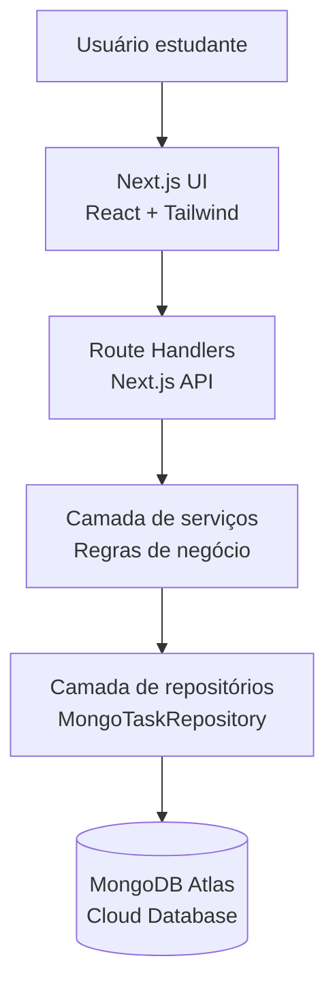

# Arquitetura básica — Agenda Escolar Prioritária

## Visão geral

A aplicação será uma agenda escolar em formato de taskboard de prioridades. O usuário poderá cadastrar, visualizar, organizar e priorizar tarefas acadêmicas, como provas, trabalhos, leituras, atividades e compromissos escolares.

A solução é fullstack com Next.js, usando rotas serverless para a camada de backend e **MongoDB Atlas** para persistência escalável em nuvem.

## Objetivo

Criar uma base funcional para uma agenda escolar visual, simples e demonstrável, atendendo aos requisitos do projeto avaliativo:

- entrada do usuário via interface web;
- pelo menos duas funcionalidades principais com regra de negócio real;
- saída estruturada e validável;
- arquitetura documentada com suporte de IA;
- preparação para testes, documentação e pipeline CI/CD.

## Stack final

- **Next.js 14** com App Router.
- **TypeScript**.
- **React 18** para interface.
- **API Routes (Route Handlers)** para backend serverless.
- **MongoDB Atlas** (DBaaS) via **Mongoose**.
- **Tailwind CSS** para estilização moderna com **Dark Mode**.
- Camada de serviço para regras de negócio (Hexagonal).
- Camada de repositório para acesso ao banco.
- Testes com **Vitest** e **Coverage v8**.
- Pipeline CI/CD com **GitHub Actions**.

## Observação técnica sobre Persistência

Originalmente concebida com H2 em memória, a aplicação evoluiu para usar **MongoDB Atlas**. Isso garante que os dados não sejam perdidos entre requisições serverless (Vercel) e permite que a aplicação seja acessível de qualquer lugar com consistência.

A arquitetura segue o padrão **Hexagonal**, permitindo que a troca da infraestrutura (de Memória para JSON e finalmente para MongoDB) tenha sido feita alterando apenas os adaptadores, sem impactar as regras de domínio.

## Diagrama de arquitetura



## Responsabilidades por camada

### Interface web

Responsável por:

- exibir taskboard escolar com navegação em abas;
- receber entradas do usuário;
- permitir edição e exclusão de tarefas;
- renderizar modo claro e escuro.

### Backend serverless

Responsável por:

- receber requisições HTTP (GET, POST, PUT, DELETE);
- validar dados de entrada;
- gerenciar pool de conexões com MongoDB.

### Serviços de domínio

Responsáveis por regras de negócio.

- **Cálculo de Prioridade:** Algoritmo que gera um *score* de 4 a 12 baseado em Peso Acadêmico, Urgência, Tipo de Atividade e Proximidade do Prazo.

## Estrutura de pastas

```text
src/
  app/              # Rotas Next.js (App Router)
  domain/           # Entidades e Regras de Negócio Puras
  application/      # Casos de Uso e Portas (Interfaces)
  infrastructure/   # Adaptadores (MongoDB, JSON, etc)
  presentation/     # Componentes React Estilizados
  lib/              # Singletons e utilitários (Mongo client)
  tests/            # Suíte de Testes Automatizados
```

## Decisões técnicas

### Persistência em Nuvem
A escolha pelo MongoDB Atlas permite o deploy funcional na Vercel e compartilhamento global de dados, superando as limitações de bancos em memória ou arquivos locais.

### Cobertura de Testes
O projeto mantém 100% de cobertura nos arquivos de lógica, garantindo que refatorações de banco de dados não quebrem as regras de prioridade ou validação.

## Relação com requisitos de entrega

Esta arquitetura atende integralmente ao manual de IA para Desenvolvedores, demonstrando ciclos de refinamento, documentaçãoSwagger, Pipeline CI/CD e decisões técnicas justificadas.
